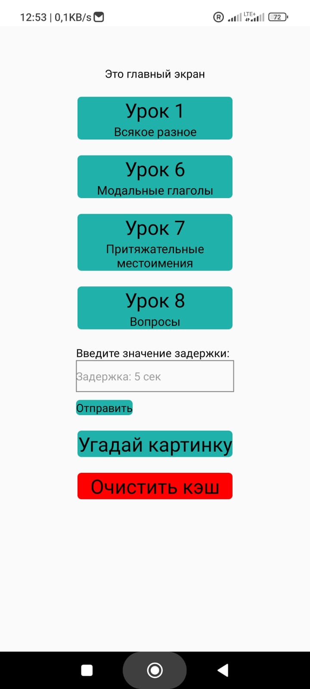

# Приложение "Dawai-Dawai"

Это мобильное приложение на React Native, которое поможет вам изучать немецкий язык.

<p align="center">
  
</p>

## Описание

Приложение представляет собой увлекательную игру для более глубокого изучения слов и грамматики. Теперь с дополнительным функционалом:

- Угадывание дней недели по русскому переводу.
- Угадывание, что изображено на картинках для запоминания слов.
- Переводы слов и предложений для расширения словарного запаса.
- Урок "Модальные глаголы".
- Урок "Притяжательные местоимения".
- Урок "Вопросы".

## Особенности

- Простой интерфейс.

## Технологии

Проект использует следующие технологии:

- React Native для разработки мобильного приложения.
- Expo для упрощения процесса разработки и сборки.
- React Redux для управления состоянием.
- Redux Persist для сохранения состояния приложения между сеансами.
- React Router Native для навигации между экранами.

## Установка и запуск

Чтобы установить и запустить приложение, выполните следующие шаги:

1. Склонируйте репозиторий:

```shell
git clone git@github.com:maxtish/Wochentage-App.git
```

2. Перейдите в папку с проектом: `cd Wochentage-App`
3. Установите зависимости: `npm install`
4. Запустите приложение: `npm start`

## Автор

- Тищенко Максим
- Ссылка на профиль GitHub: [maxtish](https://github.com/maxtish)

## Лицензия

Этот проект лицензирован в соответствии с лицензией MIT.

## Для получения APK-файла

Для получения APK-файла из проекта Expo, вам потребуется выполнить несколько шагов. Вот подробная инструкция:

1. Установите eas-cli, если у вас его нет:

```shell
 npm install -g eas-cli
```

2. Затем в командной строке выполните следующую команду, чтобы зайти в ваш аккаунт Expo:

```shell
  eas login
```

3. После успешной авторизации выполните команду:

```shell
eas build -p android
```

Процесс сборки APK будет запущен. Следуйте инструкциям в консоли для настройки сборки.

- Вот ссылка на мой [expo](https://expo.dev/accounts/rd-max/projects/wochentage)
